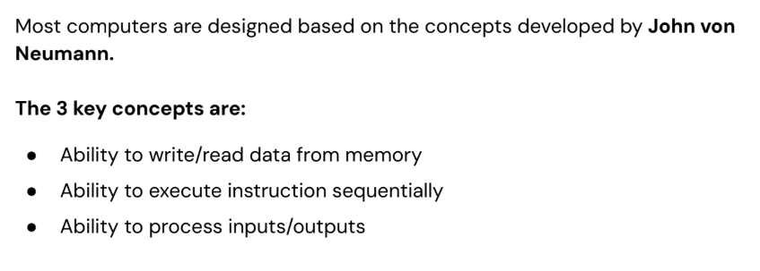
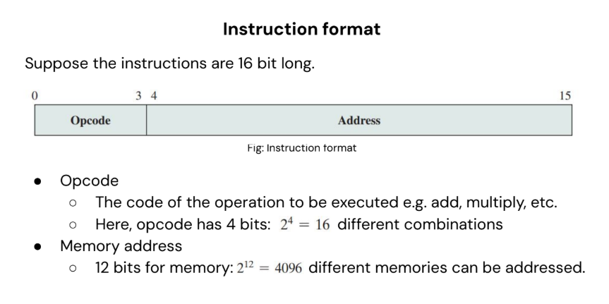
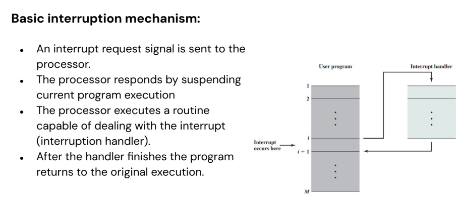
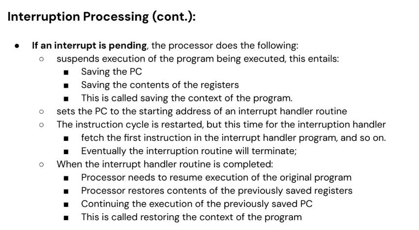
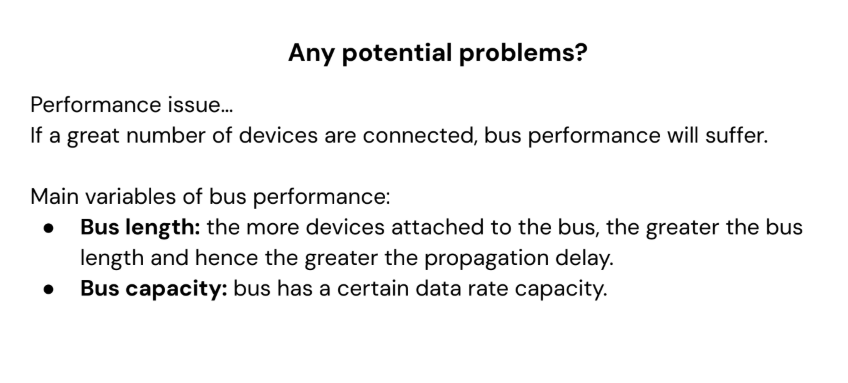

# Lecture 2: Control Unit and Interconnection Structures



## Control Unit: Hardwired vs. Microprogrammed

### Why Hardwired is Blazing Fast

Think of it like two ways to get from your bedroom to the kitchen:

<b>Microprogrammed</b>: You have a printed checklist: "1. Open door, 2. Turn left, 3. Walk 10 steps..." You read and follow each step.

- **Hardwired**: You've done it so many times that it's pure muscle memory. Your body executes it automatically without conscious thought.

The hardwired path has zero interpretation overhead.

### The Modern Context

Today's CPUs use a hybrid approach to get the best of both worlds:

**Common, Simple Instructions** (ADD, LOAD, STORE): Use hardwired control for maximum speed. This is the fast path.

**Complex/Rare Instructions** (e.g., some legacy x86 instructions): Use microcode for flexibility and backward compatibility. This is the slower, fallback path.

For example, when you run an old x86 program on a modern Intel CPU:

- Simple operations fly through the hardwired circuits.
- A complex, rarely-used instruction might trigger a "microcode assist" where the CPU looks up a sequence of simpler operations (micro-ops) to emulate it.

**Disadvantages of Hardwired programming**: Rigid design, and difficult to modify or extend.

On the other hand, a general purpose computer design will have:

1. A module capable of arithmetic and logic operations (ALU)
2. A way to control that module (Control Unit)

## Key Concepts

#### Buffer Register

A temporary holding area for data that's being transferred from one place to another.

**Example**: When you type on a keyboard, each keypress goes to a keyboard buffer register before the CPU processes it. This prevents losing keystrokes if the CPU is busy.

#### Address Register

A register that holds a memory address (a location), not the actual data. The memory system looks at the address register and fetches data from that location.

---

## Instruction Cycle



### The 7 Steps of Instruction Cycle

**Visual Example**: ADD R1, R2, R3

Let's trace through all 7 steps:

| Step   | What Happens                          | Registers/Values              |
| ------ | ------------------------------------- | ----------------------------- |
| 1. IAC | "Next instruction is at PC=0x100"     | PC = 0x100                    |
| 2. IF  | Fetch instruction from 0x100          | IR gets ADD R1, R2, R3        |
| 3. IOD | "This is ADD, use R2 & R3, put in R1" | Decode: ADD, R2=5, R3=3       |
| 4. OAC | "Operands are in registers, skip"     | (Skipped - data in registers) |
| 5. OF  | Get values from R2 and R3             | R2=5, R3=3 → ALU inputs       |
| 6. DO  | ALU adds 5 + 3                        | ALU result = 8                |
| 7. OS  | Store 8 into R1                       | R1 = 8                        |

**Result**: 2+3=5, store result in R1 ✓

### Instruction Cycle Performance: Pipelining

Remember our discussion about pipelining? This is exactly what gets pipelined!

**Without pipelining (slow)**:

```plaintext
Instruction 1: IAC→IF→IOD→OAC→OF→DO→OS (7 cycles)
Instruction 2: IAC→IF→IOD→OAC→OF→DO→OS (7 cycles)
Total: 14 cycles for 2 instructions
```

**With pipelining (fast!)**:

```plaintext
Cycle 1: I1-IAC
Cycle 2: I1-IF   I2-IAC
Cycle 3: I1-IOD  I2-IF   I3-IAC
Cycle 4: I1-OAC  I2-IOD  I3-IF   I4-IAC
...
```

Now we get 1 instruction finished per cycle after the pipeline fills up!

---

## Program Interrupts




### What is an Interrupt?

A program can be interrupted to handle events like I/O completion, timer expirations, or hardware signals.

**Analogy**: Imagine you're a chef (CPU) cooking in a kitchen (running a program).

You're following a recipe (your program), carefully measuring ingredients. Suddenly:

- Timer goes off (hardware interrupt)
- Waiter shouts "ORDER UP!" (I/O interrupt)
- You cut your finger (exception/error interrupt)

**The Problem**: You need to deal with these immediately, but you also need to remember exactly where you were in your recipe so you can continue later.

### What is an Interrupt Service Routine (ISR)?

An ISR is a special function that handles these interruptions. Think of it as an "Emergency Procedure Card" taped to the wall for each type of emergency.

- For the timer: "1) Check oven, 2) Remove food, 3) Turn off timer"

- For the waiter: "1) Take order slip, 2) Start cooking new order"

- For the cut finger: "1) Apply bandage, 2) Call for help"

### The 3 Key Parts of an ISR

#### 1. Determine the Nature of the Interrupt

**"What just happened?"**

- Chef's thought: Looks around: "Oh, it was the timer, not the fire alarm."
- ISR checks which device interrupted
- Each device has its own interrupt number
- CPU looks up the correct ISR for that interrupt

**Technical**: The CPU checks the Interrupt Vector Table (a phonebook of ISRs) to find the right ISR address.

#### 2. Perform the Required Actions

**"Do what needs to be done"**

- Chef's action: Takes food out of oven, turns off timer.
- ISR does the minimal work to handle the interrupt
- Should be fast (you don't want to ignore other emergencies)

**Examples**:

- Keyboard ISR: Read the keycode, put it in buffer
- Disk ISR: Read a sector of data from disk
- Timer ISR: Update system clock, check if a process' time slice expired

#### 3. Context Switching

**"Remember where I was, then get back to work"**

This is the magic trick that makes interrupts work!

Chef's action before handling timer:

1. PAUSE cooking
2. QUICKLY NOTE: "I was on step 3, had 2 cups of flour measured"
3. Handle the timer emergency
4. LOOK AT NOTES: "Ah yes, step 3 with 2 cups flour"
5. CONTINUE exactly where left off

### The Technical Context Switch Process

**Step A: Save Current Context (Freeze Frame)**

- Save ALL registers (PC, IR, registers, flags) to stack/memory
- Like taking a photo of the CPU's exact state

**Step B: Switch to ISR**

- Load ISR's address into PC
- Switch to kernel mode (privileged mode)
- Disable other interrupts (usually)

**Step C: Execute ISR**

- Run the interrupt handler code
- Do the minimal required work

**Step D: Restore Context (Rewind)**

- Restore all saved registers from stack
- Re-enable interrupts
- Resume execution exactly where interrupted

### Visual Example: Keyboard Interrupt

```text
User Program:                ISR Execution:
┌─────────────────┐         ┌───────────────────────────────────┐
│ printf("Hello");│         │ 1. Save ALL registers to stack    │
│ int x = 5 + 3;  │◄──┐     │ 2. Determine: "Keyboard interrupt"│
│                 │   │     │ 3. Read keycode from keyboard     │
│                 │   │     │ 4. Put 'A' in keyboard buffer     │
└─────────────────┘   │     │ 5. Send ACK to keyboard           │
                      │     │ 6. Restore registers from stack   │
   User presses 'A'   │     │ 7. Return to user program         │
  (Keyboard interrupt)┘     └─────────────────┬─────────────────┘
                                              │
                                              ▼
                                        ┌─────────────────┐
                                        │ int x = 5 + 3;  │  ← EXACTLY where it left off!
                                        │                 │
                                        │                 │
                                        └─────────────────┘
```

**Magic**: The user program has no idea it was interrupted! It continues as if nothing happened, except now there's an 'A' in the keyboard buffer.

### Why ISRs Matter for Software Engineers

#### 1. Responsive Systems

Without interrupts, the CPU would have to poll (constantly check):

```c
// The BAD way (polling):
while(1) {
    if (keyboard_has_key()) handle_key();
    if (mouse_moved()) handle_mouse();
    if (timer_expired()) handle_timer();
    // Wastes CPU time checking when nothing happens!
}

// The GOOD way (interrupts):
// CPU works normally until interrupt occurs
// ISR handles it immediately, then returns
```

#### 2. Real-Time Systems

- Medical devices, aircraft control, robotics
- **Hard real-time**: ISR MUST finish within deadline (or system fails)
- **Soft real-time**: ISR should finish quickly (or quality degrades)

#### 3. Concurrency & Race Conditions

ISRs can interrupt anytime, even during another ISR!

```c
int counter = 0;  // Shared between main program and ISR

// Main program:
counter++;  // Suppose counter is now 5

// ISR interrupts RIGHT HERE!
// ISR also does: counter++;
// Now counter = 6

// Main program continues, expects counter=6
// But what if main was doing: counter = counter * 2?
// Disaster! Need synchronization (disable interrupts, locks)
```

#### 4. Debugging

When your program crashes:

- The exception ISR kicks in
- It saves the crash context (registers, stack)
- Shows you a stack trace

Without ISRs, crashes would just freeze the system.

### The ISR "Golden Rules"

- **Keep it SHORT**: Like a pit stop in racing. In, do minimum work, out.
- **Don't block**: Never wait for I/O inside ISR (use deferred processing)
- **Re-entrancy**: ISRs can interrupt themselves! Code must handle this.
- **Save EVERYTHING**: Context must be perfectly restored.

**In a nutshell**: An ISR is the CPU's emergency response team. It's a tiny, fast, specialized function that handles interruptions, saves the exact state of what was happening, does its job, and makes everything continue as if nothing happened. It's what allows your computer to be responsive while doing multiple things "at once."

---

## Multiple Interruptions

### The Analogy: The Emergency Room Triage

Imagine an Emergency Room (ER) with one doctor (CPU). Patients arrive with emergencies (interrupts).

**Emergency Examples**:

- Heart attack (HIGH priority)
- Broken arm (MEDIUM priority)
- Paper cut (LOW priority)
- Someone asking for directions (VERY LOW priority)

### Approach 1: "Lock the Door" (Disable All Interrupts)

**How it Works**:

When any patient arrives, the doctor:

- LOCKS the ER door (disables interrupts)
- Treats the current patient completely
- UNLOCKS the door (enables interrupts)
- Checks if anyone else is waiting

**Example Timeline**:

```text
Time 0: Paper cut patient arrives → Door LOCKED
       Doctor starts treating paper cut...
Time 1: HEART ATTACK patient arrives!
       **BUT DOOR IS LOCKED** → Ignored! ❌
Time 2: Paper cut treatment finishes → Door UNLOCKED
       Doctor sees heart attack patient (too late!)
```

**The Problems (Disadvantages)**:

1. **Important interruptions get ignored** - The heart attack patient could die while doctor treats a paper cut. In computers: A disk finishing a critical read gets ignored while CPU handles a mouse movement.

2. **Data may be lost** - What if the heart attack patient gives up and leaves? In computers: Network packets arrive but buffer overflows and data is lost.

3. **Increased latency for critical events** - Heart attack patient waits 2 minutes for paper cut. In computers: Real-time systems (car brakes, pacemakers) can't wait.

4. **Loss of system responsiveness** - ER appears "frozen" to new patients. In computers: Mouse/keyboard stop responding during disk access.

### Approach 2: "Triage System" (Priority-Based Nested Interrupts)

**How it Works**:

Each emergency has a priority level. The doctor can be interrupted, but only by higher-priority emergencies.

**Priority Rules**:

- Heart attack (9) > Broken arm (5) > Paper cut (1)
- Higher number = Higher priority

**Example Timeline**:

```text
Time 0: Paper cut (priority 1) arrives
       Doctor starts treating paper cut...
Time 1: Heart attack (priority 9) arrives!
       **PAPER CUT IS PAUSED** (save state)
       Doctor immediately switches to heart attack
Time 2: Heart attack stabilized (not fully treated)
Time 3: Broken arm (priority 5) arrives
       **CONTINUE heart attack** (5 < 9, so NO interrupt)
Time 4: Heart attack fully treated
       Resume paper cut from where paused
Time 5: Paper cut finished
       Treat broken arm
```

**Visualizing Nested Interrupts**:

```text
┌─────────────────────────────────────────────────────┐
│     Paper Cut (Priority 1)                          │
│        │                                            │
│        ▼ Heart Attack (Priority 9) interrupts!      │
│        ┌────────────────────────────────────┐       │
│        │Heart Attack Treatment              │       │
│        │   │ Broken Arm (5) tries...        │       │
│        │   │   NO - priority 5 < 9          │       │
│        │   ▼ Heart Attack completes         │       │
│        └────────────────────────────────────┘       │
│        │ Resume Paper Cut                        │
│        ▼ Paper Cut completes                    │
│        Treat Broken Arm                         │
└─────────────────────────────────────────────────────┘
```

### Technical Implementation: Interrupt Priority Levels (IPL)

In real CPUs, there's an Interrupt Priority Level register:

```c
// Pseudocode of what happens
void handle_interrupt(int interrupt_number) {
    int current_priority = get_current_priority();
    int new_priority = get_interrupt_priority(interrupt_number);

    if (new_priority > current_priority) {
        // NESTED INTERRUPT ALLOWED
        save_context();
        set_priority(new_priority);
        execute_isr(interrupt_number);
        restore_context();
        set_priority(current_priority);
    } else {
        // INTERRUPT DEFERRED
        // Put in pending queue, handle later
        queue_interrupt(interrupt_number);
    }
}
```

### Real-World Examples

**Example 1: Computer System**

```text
Priority 7: Power failure (MUST save data to disk immediately!)
Priority 6: Disk I/O complete
Priority 5: Network packet received
Priority 4: Timer tick (for multitasking)
Priority 3: Keyboard press
Priority 2: Mouse movement
Priority 1: USB device plugged in
```

**Example 2: What Actually Happens When You Type**:

```text
1. You press 'A' → Keyboard interrupt (priority 3)
2. Keyboard ISR starts reading key...
3. DISK FINISHES loading file → Disk interrupt (priority 6)!
   - Keyboard ISR is PAUSED
   - Disk ISR runs (higher priority 6 > 3)
   - Disk ISR completes
   - Resume keyboard ISR
4. Keyboard ISR finishes, puts 'A' in buffer
5. You see 'A' appear on screen
```

You never notice the disk interrupt happened between keypress and display!

### Special Problems with Nested Interrupts

#### 1. Stack Overflow

If interrupts keep interrupting each other:

```text
ISR Priority 1 → saves context (stack +1)
ISR Priority 3 interrupts → saves context (stack +2)
ISR Priority 7 interrupts → saves context (stack +3)
ISR Priority 9 interrupts → saves context (stack +4)
...STACK OVERFLOW!!!!
```

**Solution**: Limit nesting depth or use separate stacks.

#### 2. Priority Inversion

What if:

- Low-priority task LOCKED a resource
- Medium-priority task runs (okay so far)
- High-priority task needs SAME resource → BLOCKED by low-priority!
- High-priority waits for low-priority (inversion!)

**Solution**: Priority inheritance or priority ceiling protocols.

#### 3. Race Conditions

Two interrupts modifying same data:

```text
ISR_A: counter++;  // Reads counter=5
<-- ISR_B interrupts!
ISR_B: counter = 0;
<-- ISR_B finishes
ISR_A: continues... writes 6 (but should be 1!)
```

**Solution**: Disable interrupts for critical sections or use atomic operations.

### Why This Matters for SWE

**Choosing the Right Approach**:

- **Embedded systems**: Often use Approach 1 (simpler, predictable)
- **General-purpose OS**: Always use Approach 2 (Windows, Linux, macOS)
- **Real-time OS**: Approach 2 with strict timing guarantees

**Debugging "Weird" Bugs**:

- "My program crashes... sometimes" → Often due to interrupt race conditions
- Use `volatile` keyword for shared variables

**Writing Device Drivers**:

- Must know interrupt priorities
- Keep ISRs short to avoid blocking higher-priority interrupts
- Use deferred work (tasklets, workqueues) for long operations

**Performance Tuning**:

- Too many high-priority interrupts = system sluggish
- Balance priorities based on actual needs

---

## Interconnection Structures

### What are Interconnection Structures?

A computer is a network of basic modules. The collection of paths connecting the various modules is called the **interconnection structure**.

These modules need to communicate with each other in order to:

- Exchange data
- Exchange control signals

### Types of Interconnection Structures

The most common interconnection structures are:

1. **Bus Interconnection**
2. **Point-To-Point Interconnection**

```text
CPU RAM GPU HDD Network
│ │ │ │ │
▼ ▼ ▼ ▼ ▼
──────────────────────────────────────────
THE BUS (shared wire)
```

### How it works

- **Arbitration:** Who gets to use the bus? (Like a traffic light)
- **Transmission:** One device talks, others listen
- **Addressing:** Each message says "This is for RAM" or "This is for GPU"



### Bus Structure — The 3 Types of "Lanes"

Every bus has three types of lines:

#### Data Bus (The Cargo Truck)

Carries the actual information being transferred.

Width determines how much data moves at once:

- **8-bit bus** = 1 lane (moves 1 byte at a time)
- **32-bit bus** = 4 lanes (moves 4 bytes at a time)
- **64-bit bus** = 8 lanes (moves 8 bytes at a time)

#### Address Bus (The Destination Label)

Specifies WHERE the data should go.

Width determines how many locations you can address:

- **16-bit address bus** = 65,536 locations (2¹⁶)
- **32-bit address bus** = 4.3 billion locations (2³²) ← Modern computers

Example: Address bus says "Memory location 0x1000", Data bus sends the number "42" to that location.

#### Control Bus (The Traffic Signals)

Coordinates everything — tells devices what to do. Contains signals like:

- **Read/Write:** "Are we reading or writing?"
- **Clock:** Keeps everything synchronized
- **Interrupt:** "Hey, I need attention!"
- **Reset:** "Everyone start over!"

### Complete Bus Example — CPU reads from RAM

```text
1. CPU places address `0x1000` on the ADDRESS bus
2. CPU asserts the `READ` signal on the CONTROL bus
3. RAM sees the address matches and places data `42` on the DATA bus
4. CPU reads `42` from the DATA bus
```

## Point-to-Point Interconnection (Private Highways)

Direct, dedicated connections between specific components — like private roads between buildings.

```text
CPU ────── RAM    (Direct memory channel)
  ╲       ╱
   ╲     ╱
     GPU ────── Monitor  (Direct video channel)
         │
         └─────── HDD       (Direct storage channel)
```

### Modern Example: Smartphone / Computer

- Memory Controller → RAM (DDR)
- PCI Express → GPU, NVMe SSD, Network card
- USB Controller → Keyboard, mouse
- DisplayPort/HDMI → Monitor

### Comparison: Bus vs Point-to-Point

| Aspect      |   Bus Interconnection |        Point-to-Point |
| ----------- | --------------------: | --------------------: |
| Speed       |       Slower (shared) |    Faster (dedicated) |
| Cost        | Cheaper (fewer wires) |        More expensive |
| Scalability |     Poor (contention) | Excellent (add links) |
| Complexity  |               Simpler |  More complex routing |
| Bandwidth   |       Shared, limited |        High, per link |
| Latency     |  Higher (arbitration) |        Lower (direct) |

### Evolution — Why we switched

**Old (1990s)** — Single shared bus (many devices fight for one channel):

```text
CPU ───┐
RAM ───┤
GPU ───┼─── ISA/PCI BUS (shared)
HDD ───┤
Sound ─┘
```

**Modern** — Hybrid: point-to-point for high-speed links, buses for low-speed peripherals:

```text
                ┌─────────── RAM (DDR4/5 bus)
                │
CPU ─────┼─────────── GPU (PCIe x16 - point-to-point)
                │
                └─────────── Chipset ─┬── USB (bus)
                                                                 ├── SATA (bus)
                                                                 └── Ethernet (point-to-point)
```

### Real-world Examples

**USB Hub (bus)**

```text
Computer ─── USB Hub ─┬── Keyboard
                                                 ├── Mouse
                                                 ├── Printer
                                                 └── Webcam
```

- All devices share USB bandwidth; only one talks at a time.

**PCI Express (point-to-point)**

```text
CPU ─── PCIe x16 ─── GPU
CPU ─── PCIe x4  ─── NVMe SSD
CPU ─── PCIe x1  ─── Network card
```

- Each device gets dedicated lanes; multiple transfers can occur simultaneously.

**Memory bus**

```text
CPU ─── Memory Controller ─── RAM sticks
```

- RAM often still uses a shared bus between DIMMs for cost reasons; memory controllers optimize access.

### Why this matters for software engineers

- Performance: data locality and sequential access reduce bus contention.
- Hardware choice: gaming/workstation/server needs differ by PCIe/QPI requirements.
- Debugging: shared buses can cause unexpected contention and slowdowns.

```c
// Example: cache-friendly iteration
for (int i = 0; i < N; i++) {
        sum += array[i]; // sequential = efficient
}

// Bad: random access causes cache misses and bus inefficiency
for (int i = 0; i < N; i++) {
        sum += array[random_index[i]];
}
```

```c
// BAD: scattered layout
struct Bad {
        int id;
        char name[100];
        double salary;
};

// BETTER: related data grouped
struct Good {
        int id;
        double salary;
        char name[100];
};
```

**In a nutshell:**

- Bus = shared conversation (cheap, simple)
- Point-to-point = private highways (fast, scalable)

Modern systems use a hybrid of both.

#### PCIe and QPI

Think of computer components as cities:

- Old Bus System = one highway everyone shares (traffic jams)

- QPI = private, high-speed links between CPUs

- PCI Express = private express lanes to devices (GPU, SSD, etc.)

1. QPI (QuickPath Interconnect) — CPU-to-CPU superhighway
   QPI is Intel's protocol for CPU-to-CPU and CPU-to-memory communication in multi-processor systems.

**Main characteristics:**
<ol type="A">
<li> Multiple direct connections

```text
CPU1 ─────── CPU2
  │ ╲        ╱ │
  │  ╲      ╱  │
  │   ╲    ╱   │
CPU3 ─────── CPU4
```

No arbitration traffic lights; many simultaneous conversations.</li>

<li> Layered protocol (like TCP/IP)

```text
Simple Bus: "HEY MEMORY GIVE ME DATA AT 0x1000"
QPI Packet: [FROM:CPU1][TO:MEMORY][TYPE:READ][ADDR:0x1000][ERROR_CHECK]
```
</li>

<li> Packetized transfer provides error detection, prioritization, and multiplexing.</li>

</ol>

***QPI's 4 layers***: physical, link, routing, protocol (reliable delivery, routing decisions, coherence rules).
QPI's 4 Layers (Like an Onion)
**Layer 1: Physical Layer (The Wires & Electricity)**
Actual copper wires on the motherboard

Differential signaling (uses wire pairs for noise immunity)

Clock recovery circuits

Like the physical roads and traffic lights

**Layer 2: Link Layer (The Delivery Van)**
- Reliable delivery: Retransmits if packet gets corrupted

- Flow control: "Slow down, I can't handle more packets!"

- Error detection: Checks CRC in trailer

Like UPS/FedEx - ensures packages arrive intact

**Layer 3: Routing Layer (The GPS Navigation)**
- Decides the path: "Should this go direct or through CPU2?"

- Load balancing: Avoids congested paths

Like Google Maps choosing the best route

**Layer 4: Protocol Layer (The Business Rules)**
- High-level rules: "This is a memory read request"

- Coherence protocols: Ensures all CPUs see same memory values

Like business contracts between companies

**Complete Flow:**

```text
CPU wants to read memory:
1. PROTOCOL Layer: Creates "Memory Read" request
2. ROUTING Layer: Chooses path to memory controller
3. LINK Layer: Wraps in envelope with error check
4. PHYSICAL Layer: Sends electrons over wires
```

### 2. PCI Express (PCIe) — the device superhighway

PCIe connects GPU, SSD, NIC, etc., using scalable lanes.

#### Key features

##### 1. Faster data rates

```text
Old PCI:        133 MB/s  ← one-lane country road
PCIe Gen 3:    ~985 MB/s per lane ← multi-lane highway
PCIe Gen 4:   ~1,970 MB/s per lane ← superhighway
PCIe Gen 5:   ~3,940 MB/s per lane ← hyperloop!
```

##### 2. Dedicated Point-to-Point Connection (The BIG Difference)

**Old PCI Bus (Shared)**:

```text
┌─────┐ ┌─────┐ ┌─────┐
│ GPU │ │ SSD │ │ NIC │  ← All fighting for same road!
└──┬──┘ └──┬──┘ └──┬──┘
   └───────┼───────┘
           │
      ┌────▼────┐
      │ PCI BUS │  ← Traffic jam central!
      └────┬────┘
           │
      ┌────▼────┐
      │  CPU    │
      └─────────┘
```

**PCI Express (Private Lanes)**:

```text
      ┌─────────┐
      │  CPU    │
      └───┬─────┘
          │
   ┌──────┼──────┐
   │      │      │
┌──▼──┐┌──▼──┐┌──▼──┐
│ GPU ││ SSD ││ NIC │  ← Each has own private highway!
└─────┘└─────┘└─────┘
(x16 lanes) (x4 lanes) (x1 lane)
```

##### 3. Scalable Bandwidth (Lane System)

PCIe uses lanes (like highway lanes):

- **x1** = 1 lane (basic devices - sound card, USB controller)
- **x4** = 4 lanes (SSDs, network cards)
- **x8** = 8 lanes (mid-range GPUs)
- **x16** = 16 lanes (gaming GPUs)

Your motherboard might have:

```text
PCIe x16 slot ────▶ GPU (gets 16 lanes)
PCIe x4  slot ────▶ NVMe SSD (gets 4 lanes)
PCIe x1  slot ────▶ WiFi card (gets 1 lane)
```

#### How PCIe Actually Works

##### Physical Layer: SerDes (Serializer/Deserializer)

Instead of 16 separate wires for 16 lanes, data is serialized:

```text
Parallel (old): 16 bits at once on 16 wires
Serial (PCIe): 16 bits in sequence on 1 wire pair (but much faster!)
```

##### Packet-Based Like QPI

```text
┌─────────────────────────────────────────┐
│ Transaction Layer Packet (TLP)          │
│ From: CPU, To: GPU, Type: Memory Write  │
│ Data: Texture for game                  │
└─────────────────────────────────────────┘
```

##### Differential Signaling

Uses wire pairs for noise immunity:

```text
Wire A: ────┬─── Signal
            │
Wire B: ────┴─── INVERSE of Signal
```

If noise affects both wires equally, the difference remains correct!

#### Real-World Examples

##### Example 1: Gaming PC

```text
CPU ─── QPI ─── Other CPU (if dual processor)
  │
  ├── PCIe x16 ─── GPU (16 private lanes for gaming)
  │
  ├── PCIe x4 ──── NVMe SSD (4 lanes for fast game loading)
  │
  └── PCIe x1 ──── Sound card (1 lane, enough for audio)
```

**Why this matters**: When gaming:

- GPU gets full bandwidth to CPU (no sharing!)
- SSD can load textures while GPU renders
- Sound card plays audio simultaneously

##### Example 2: Data Center Server

```text
CPU1 ─── QPI ─── CPU2 ─── QPI ─── CPU3
  │        │        │        │        │
  ├────────┴────────┼────────┴────────┤
  │      Shared Memory Access         │
  │                                   │
PCIe x16      PCIe x16        PCIe x16
   ▼              ▼                ▼
GPU Cluster   NVMe Array     100Gb Network
```

### Why This Matters for Software Engineers

#### 1. Understanding System Architecture

When you write code that uses:

- **Multiple threads** → They might be on different CPUs connected via QPI
- **GPU computing** → Data travels over PCIe
- **Fast storage** → NVMe uses PCIe x4

#### 2. Performance Optimization

```c
// BAD: Transfer small chunks over PCIe repeatedly
for (int i = 0; i < N; i++) {
    cudaMemcpy(device, host, sizeof(float), ...); // PCIe overhead each time!
}

// GOOD: Transfer once in bulk
cudaMemcpy(device, host, N * sizeof(float), ...); // One big efficient transfer
```

#### 3. Debugging Performance Issues

- "My GPU is slow" → Check if it's in x16 slot, not x8
- "NVMe SSD not reaching rated speed" → Might be sharing PCIe lanes
- "CPU communication bottleneck" → Might be QPI link saturation

#### 4. Hardware Selection

- **Gaming**: Need PCIe x16 for GPU, PCIe x4 for SSD
- **Workstation**: Might need multiple PCIe x16 for multiple GPUs
- **Server**: Needs QPI for multi-CPU communication

### The Big Picture: Modern Computer Architecture

```text
┌─────────────────────────────────────────────────┐
│              MODERN COMPUTER                     │
│                                                 │
│   CPU₁ ─── QPI ─── CPU₂   (CPU superhighway)   │
│    │                  │                         │
│    ├─ DDR ── RAM      │  (Memory access)        │
│    │                  │                         │
│  PCIe Root Complex    │  (Device highway hub)   │
│    ├────┬────┬────┬───┘                         │
│    │    │    │    │                             │
│  GPU   SSD  NIC  USB  (Each gets private lanes) │
│ (x16)  (x4) (x1) (x1)                           │
└─────────────────────────────────────────────────┘
```

---

## Summary

### Key Takeaways

**Control Unit**:

- **Hardwired control** is blazing fast but rigid; **microprogrammed control** is flexible but slower
- Modern CPUs use a hybrid approach for best of both worlds

**Instruction Cycle**:

- CPU follows 7 steps: IAC → IF → IOD → OAC → OF → DO → OS
- **Pipelining** overlaps these steps to execute multiple instructions simultaneously, dramatically improving performance

**Program Interrupts & ISRs**:

- **ISRs** (Interrupt Service Routines) handle asynchronous events without halting the main program
- **Context switching** saves the CPU state, handles the interrupt, and restores everything exactly as it was
- Modern systems use **priority-based nested interrupts** so critical events (disk I/O, power failure) interrupt less important ones (mouse movement)
- **Race conditions** in ISRs require careful synchronization and keeping ISRs short

**Interconnection Structures**:

- **Bus interconnection** = shared channel (simple, cheap, but slow when busy)
- **Point-to-point interconnection** = dedicated connections (fast, expensive, but highly scalable)
- Modern computers use **hybrid systems**: Point-to-point for high-speed (QPI for CPUs, PCIe for devices) and buses for slower peripherals

**QPI & PCIe**:

- **QPI** enables multiple CPUs to communicate directly at extreme speeds with layered protocols and packet-based transmission
- **PCI Express** provides dedicated bandwidth to each device via lanes (x1, x4, x8, x16), replacing the old shared-bus bottleneck
- Understanding these interconnects is crucial for performance optimization, hardware selection, and debugging "mysterious" slowdowns
