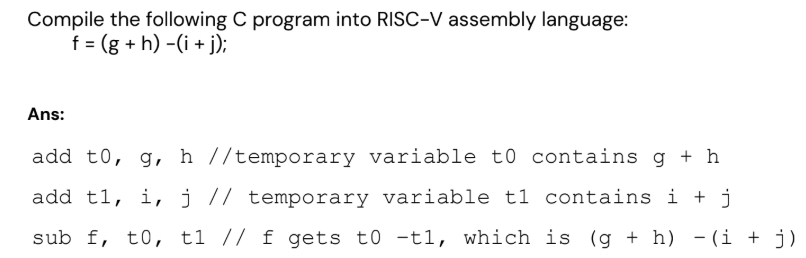

## ISA
Instruction Set Architecture (ISA) defines the set of instructions that a processor can execute. It serves as the interface between software and hardware, specifying how software controls the hardware.
ISA is the contract between hardware designers and software developers.
Hardware engineers build CPU to implement ISA exactly.
Software developers (via compilers) write machine code that follows ISA rules.
You can change hardware implementation (make it faster, more power-efficient) as long as it still obeys the ISA — old software will still run.

That’s why your Windows from 10 years ago can run on a new Intel CPU — same ISA (x86-64), but inside the CPU, implementation is totally different and much faster.


---

ISA in a CPU is like:
It’s a list of basic operations the CPU can perform, like:

ADD R1, R2, R3 (Add R2 and R3, store result in R1)

LOAD R1, [address] (Get data from memory into register)

STORE R1, [address] (Put data from register into memory)

BRANCH IF EQUAL (Jump to another instruction if two values are equal)

The CPU hardware is built to understand only these instructions.

---


### Key Parts of ISA:

An ISA defines:

Instruction formats:
How an instruction looks in binary (e.g., first 6 bits = opcode, next 5 bits = register number, etc.).

Operations available:
What instructions exist (ADD, SUB, LOAD, STORE, JUMP, etc.).

Data types:
What kinds of data can be processed (integers, floats) and their sizes.

Registers:
How many general-purpose registers exist, their names, and special registers (like PC = Program Counter).

Addressing modes:
Ways to specify where data is (in a register? in memory at address X? in memory at address in register R1 + offset? etc.).

Memory model:
How memory is addressed (byte-addressable? word-addressable?).

Input/Output:
How CPU communicates with peripherals, memory-mapped I/O vs. special I/O instructions.


---


 Real-World ISAs You Might Have Heard Of
x86 — used in Intel/AMD desktop/laptop processors (CISC type).

ARM — used in most smartphones and newer Macs (RISC type).

RISC-V — open-source ISA, gaining popularity.


### CISC vs. RISC (simple overview)
CISC (Complex Instruction Set Computer):
Lots of complex instructions — some do a lot of work in one instruction.

Example: x86 has an instruction that can do a whole loop or string copy.
Fewer instructions needed for a program, but each can take multiple clock cycles.

RISC (Reduced Instruction Set Computer):
Simpler, smaller set of instructions.
Each instruction does one small thing, runs in one clock cycle (ideally).
Makes CPU design simpler, faster, more power-efficient.


Portability:
Why can’t a Windows program compiled for Intel run directly on an ARM phone? ISA difference! That’s why you have different binaries or use intermediate bytecode (like Java bytecode) that gets translated.


**Risc V instruction example:**



### RISC V
Endianess: describes the order in which sequence of bytes are stored in computer memory.
RISC-V is little endian: least significant byte stored at lowest memory address.

Bi-endian format: allows switching between little and big endian modes.

**determining endianness**
```c
int x = 1;
if (*(char*)&x == 1) 
    printf("Little-Endian\n");
else
    printf("Big-Endian\n");
```

### Maths
For array, we need to first ld it to a variable, then we can use it.
```assembly
    ld x9, 64(x22) // Temporary reg x9 gets A[8], 64 is the byte address
    add x20, x21, x9 // g = h + A[8]
```

# RISC V Instructions
**1. R-Format (Register-Register Operations)**
For: add, sub, and, or, sll (arithmetic/logical with 3 registers)
```text
 31        25 24    20 19    15 14    12 11     7 6      0
┌─────────────┬───────┬───────┬───────┬─────────┬────────┐
│   funct7    │  rs2  │  rs1  │ funct3│   rd    │ opcode │
└─────────────┴───────┴───────┴───────┴─────────┴────────┘
      7          5        5        3        5        7
```
**Example:** add x9, x21, x9

*   opcode: 0110011 (tells CPU this is an R-type instruction)
    
*   rd: 01001 (x9 - destination register)
    
*   funct3: 000 (tells CPU it's ADD, not SUB or AND)
    
*   rs1: 10101 (x21 - first source)
    
*   rs2: 01001 (x9 - second source)
    
*   funct7: 0000000 (more detail for the operation)

**2. I-Format (Immediate Operations & Loads)**
For: addi, ld, lw, jalr (operations with immediate value)
```text
 31                 20 19    15 14    12 11     7 6      0
┌─────────────────────┬───────┬───────┬─────────┬────────┐
│     immediate[11:0] │  rs1  │ funct3│   rd    │ opcode │
└─────────────────────┴───────┴───────┴─────────┴────────┘
          12              5        3        5        7
```
**Two main uses:**

1.  **Arithmetic with constant:** addi x10, x11, 50
    
2.  **Load instructions:** ld x9, 64(x22)
    

**For loads:** The 12-bit immediate is the **offset** (like 64)


### WHy S Format splits immediate??
The 12-bit immediate in S-type format is split into two fields (upper 7 bits and lower 5 bits) to **maintain consistent field alignment with other instruction formats**, specifically the R-type format.

**Key Reasons:**

1.  **Hardware Simplicity:** Keeps the rs1, rs2, and funct3 fields in the **exact same bit positions** as in R-type instructions
    
2.  **Parallel Decoding:** The CPU can begin reading register numbers (rs1 from bits \[19:15\], rs2 from bits \[24:20\]) **before** determining the instruction type
    
3.  **Regular Design:** Follows RISC-V's design philosophy of regularity and simplicity
    

**Without splitting:** The immediate would displace rs2 from its standard position, requiring complex multiplexing logic and slowing down decoding.


## Logical Operations
Shift uses I-Format

---


**"Why split and shift?"**
--------------------------

**Short answer:**"Branch instructions drop the LSB (always 0 due to alignment) when encoding the offset. This effectively gains one extra bit of range without increasing instruction size. The offset is left-shifted by 1 during sign-extension to restore the dropped 0, doubling the branch range to ±4KB."

**Detailed points:**

1.  Instructions are aligned (LSB = 0 in addresses)
    
2.  By not storing LSB, we get 13-bit range from 12-bit field
    
3.  Immediate is split to keep rs1, rs2, funct3 aligned with R-type
    
4.  Hardware reconstructs: offset = {imm12, imm11, imm\[10:5\], imm\[4:1\], 0}