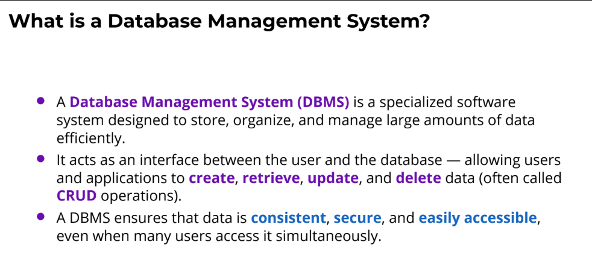
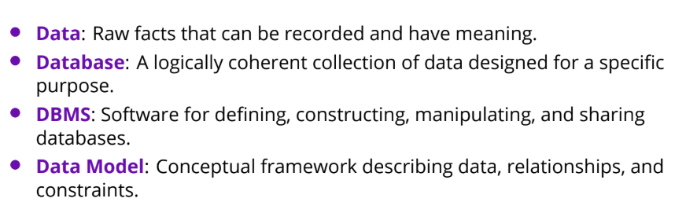

Kingdom of cod and history of database not much important.

---

---

Common examples include MySQL, PostgreSQL, Oracle Database, and
MongoDB.
Think of a DBMS as a librarian.

---

---

#### Problems if no DBMS
- Data redundancy and inconsistency
- Difficulty in accessing data
- Data isolation (multiple files and formats)
- Integrity problems
- Atomicity problems (basically transactions)
- Concurrent access anomalies
- Security problems 

#### DDL, DML, SQL
the architect, the builder, and the umbrella.

#### Database design
database design mainly focuses on the schema

---
• Logical Design – Deciding on the database schema. Database design
requires that we find a “good” collection of relation schemas.
◦ Business decision – What attributes should we record in the database?
◦ Computer Science decision – What relation schemas should we have and how should the attributes be distributed among the various relation schemas?
• Physical Design – Deciding on the physical layout of the database

---

### ACID
- Atomicity: All or nothing
- Consistency: Always follows defined rules
- Isolation: Multiple transactions do not interfere with each other
- Durability: Once committed, always committed
