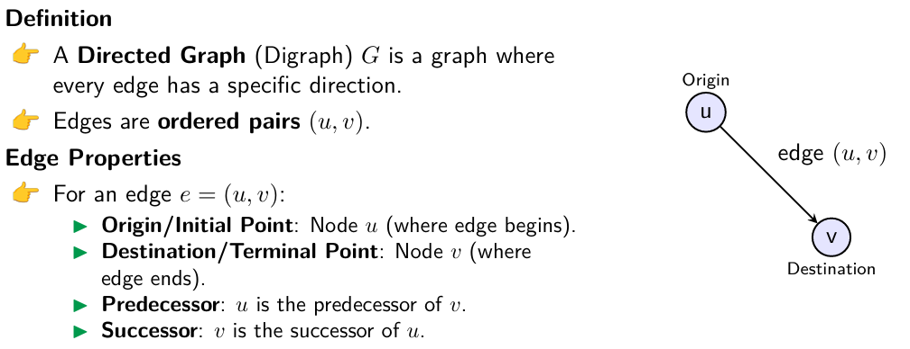
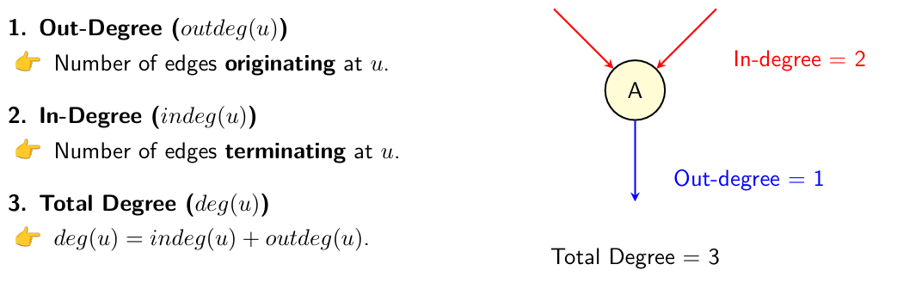
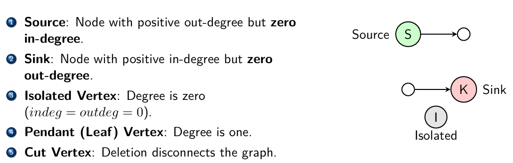
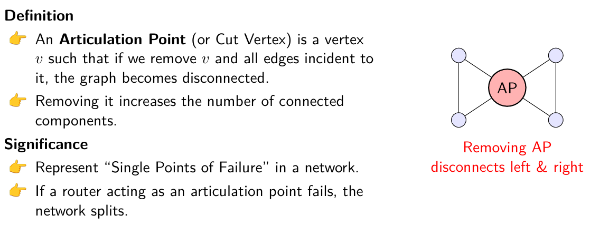
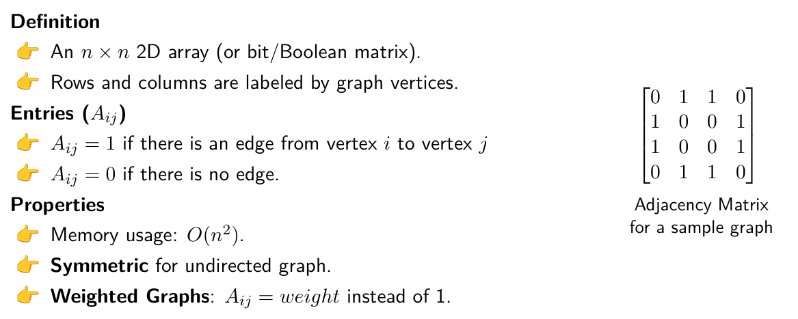

# Graph
Trees can not show many to many relation. Graph is the general non-linear data structure that allows
complex non-hierarchical relationships between nodes.
Graphs are used to model any situation where entities (things) are related to each other in pairs.

## Terminology
- **Neighbor**: Two nodes are neighbors if they are connected directly by an edge.
- **Degree**: The degree of a node is the number of edges connected to it.
- **Isolated Node**: A node with degree 0 (no edges connected to it).
- **Regular Graph**: A graph where every node has the same degree.
- **k-Regular Graph**: A graph where every node has degree k.
- **Path**: A sequence nodes where each consecutive pair are adjacent.
- **Closed Path**: A path where start and end nodes are the same.
- **Simple Path**: A path that does not contain any repeated nodes.
- **Cycle**: A closed path with at least one edge and no repeated nodes except for the start and end nodes.
- **Connected Graph**: A graph where there is a path between every pair of nodes.
- **Complete Graph**: A graph where there is an edge between every pair of nodes. Has n(n-1)/2 edges for n nodes.
- **Clique**: A subset of nodes such that every two distinct nodes are adjacent.
- **Loop**: An edge that connects a node to itself.
- **Multigraph**: A graph that allows multiple edges between the same pair of nodes.
- **Weighted Graph**: A graph where edges have weights (values) associated with them.
- **Size of a Graph**: The number of edges in the graph.
- **Order of a Graph**: The number of nodes in the graph.

# Directed Graph (Digraph)

## Terminology

- **Simple Directed Graph**: A directed graph with no loops and no multiple edges in the same direction between two nodes.

- **Transitive Closure**: The transitive closure of a directed graph is a graph that has an edge from node u to node v if there is a directed path from u to v in the original graph. Basically, it shows all the possible paths in the graph. So this makes reachability questions O(1) time complexity. “Can we get from A to B?” becomes ”Is there an edge (AB) in G*?”

### Connectivity in Directed Graphs
- **Strongly Connected**: A directed graph is strongly connected if there is a directed path from every node to every other node.
- **Weakly Connected**: A directed graph is weakly connected if replacing all of its directed edges with undirected edges produces a connected (undirected) graph.
- **Unilaterally Connected**: A directed graph is unilaterally connected if for every pair of nodes u and v, there is a directed path from u to v **or** from v to u (or both).

### Articulation Points

- **Bridge**: An edge in a graph whose removal increases the number of connected components in the graph. (Cut edge)
- **Bi-connected Graph**: A connected graph with no articulation points.

### Adjacency Matrix

**The Core Idea**
For a graph with n vertices, the adjacency matrix A is an n×n matrix where:

A[i][j] = 1 if there's an edge from vertex i to vertex j
A[i][j] = 0 otherwise

The magic happens when you raise this matrix to power k:
(A^k)[i][j] gives you the number of paths of length exactly k from node i to node j.

Raising adjacency matrix to power k mechanically counts all possible k-step connections through matrix multiplication, which is essentially exhaustive search via algebra.

### Adjacency List
Adjacency list is more space efficient for sparse graphs. It consists of an array of lists. The size of the array is equal to the number of vertices. Each entry in the array contains a list of nodes that are adjacent to the vertex.
This is preferred for sparse graphs where the number of edges is much less than the maximum possible number of edges. This takes O(V + E) space (directed) or O(V+2E) space (undirected).