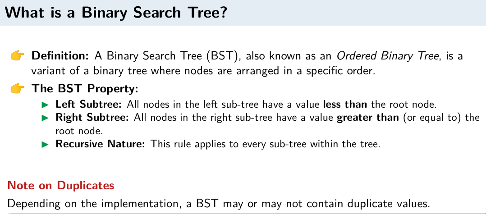
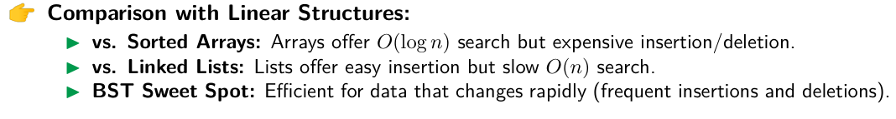

## Tree

No Cycles, Only One or zero (root) parent for a single node.

- Parent Node: Any node that has one or more child nodes

- Child Node: A node with a predecessor (parent)

- Root Node: The topmost node with no parent

- Leaf Node: A node with no

- Internal Node: A node with at least one child

- Sibling Nodes: Nodes that share the same parent

- Subtree: A tree formed by a node in a tree along with its descendants

- Level: Level represents the generation or distance from the root.

- Depth of a Node: The number of edges from the root to the node

- Degree of a Node: The number of children a node has

- Degree of a Tree: The maximum degree of any node in the tree

- Path: A sequence of consecutive edges from a source node to a destination node

- Path Length: The number of edges in a path

- Height of a Node: The number of nodes from that node to a leaf node

- Height of a Tree: The height of the root node, representing the longest path from the root to a leaf node

```cpp
// Height in recursive
int height(Node* node) {
    if (node == nullptr)
        return -1;  // Or 0, depends on convention
    return 1 + max(height(node->left), height(node->right));
}
```

- Binary Tree: A tree where each node has at most two children

- Binary Search Tree (BST): For any node N, all values in the left subtree are less than N, and all values in the right subtree are greater than N. Optimized for search operations (O(log n) on average).

- Strictly Binary Tree: A binary tree where every node has either 0 or 2 children. Like Huffman Tree.

- Complete Binary Tree: A binary tree where all levels are fully filled except possibly the last level, which is filled from left to right.

- In an Extended Binary Tree (Strictly Binary), number of external nodes = number of internal nodes + 1

- For reconstructing a unique binary tree, we need inorder traversal + either preorder or postorder traversal.
  Because Inorder tells us the left and right subtree division, and preorder/postorder tells us the root node.

- Huffman trees are weighted and strictly binary trees used for optimal prefix coding in data compression.

- Huffman COnstruction:
  

- In huffman coding, more frequent characters are assigned shorter codes, while less frequent characters receive longer codes. This variable-length coding minimizes the overall size of the encoded data.

- In huffman tree, no code is a prefix of any other code, ensuring unambiguous decoding.

- Huffman Decoding:
  

- Binary Search Tree:
  
  Bst is search efficient because it reduces the number of comparisons needed to find a value by half at each step, leading to an average time complexity of O(log n) for search operations.
  

- BST Operations:

  - Search:

  ```cpp
  Node* search(Node* root, val){
      if(root==NULL or root->data==val) return root;
      if(val < root->val) return search(root->left, val);
      else return search(root->right,val);
  }
  ```

  - Insertion:

  ```cpp
  Node* insert(Node* root, int val) {
      // 1. If tree is empty, return a new node
      if (root == nullptr) {
          return new Node(val);
      }

      // 2. Otherwise, recur down the tree
      if (val < root->data) {
          root->left = insert(root->left, val);
      } else if (val > root->data) {
          root->right = insert(root->right, val);
      }

      // 3. Return the (unchanged) node pointer
      return root;
  }
  ```

  - Deletion:

  ```cpp
  // Helper function to find largest node in a subtree
    Node* findLargestNode(Node* root) {
        // Walk all the way to the right
        while (root != nullptr && root->right != nullptr) {
            root = root->right;
        }
        return root;  // This is the largest node
    }

    // Main delete function
    Node* deleteNode(Node* root, int val) {
        if (root == nullptr) return root;  // Tree empty or value not found
        
        // Search for the node to delete
        if (val < root->data) {
            root->left = deleteNode(root->left, val);  // Go left
        } 
        else if (val > root->data) {
            root->right = deleteNode(root->right, val);  // Go right
        }
        else {  // Found the node!
            // Case 3: Node has TWO children
            if (root->left != nullptr && root->right != nullptr) {
                Node* predecessor = findLargestNode(root->left);
                root->data = predecessor->data;  // Copy the largest left value
                root->left = deleteNode(root->left, predecessor->data);  // Remove the duplicate
            }
            // Cases 1 & 2: Leaf or One child
            else {
                Node* temp = root;
                if (root->left == nullptr) {
                    root = root->right;  // Only right child exists
                } 
                else if (root->right == nullptr) {
                    root = root->left;   // Only left child exists
                }
                delete temp;  // Free the memory
            }
        }
        return root;
    }
    ```

