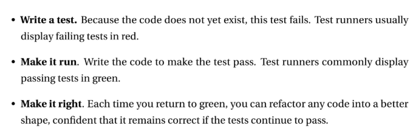

# Test Driven Development (TDD)

TDD ensures code quality by requiring tests before implementation, catching defects early in the development cycle.

<b>Why?</b>
1. Better Design: Tests force you to think about usage first
2. Safety Net: Tests catch bugs immediately
3. Documentation: Tests show how code should work
4. Confidence: Can change code without fear
5. Fewer Bugs: Catches errors early (cheaper to fix!)
6. Simpler Code: YAGNI - You only write code needed to pass tests



---

## Unit testing

JUnit basic:
```java
import static org.junit.Assert.*;  // The magic import

// 1. ASSERT EQUALS - The Workhorse
assertEquals(expected, actual);
// Example: assertEquals(5, 2+3);

// 2. ASSERT TRUE/FALSE - For Booleans
assertTrue(condition);
assertFalse(condition);
// Example: assertTrue(10 > 5);

// 3. ASSERT NULL/NOT NULL - For Existence
assertNull(object);
assertNotNull(object);
// Example: assertNotNull(user.getName());
```

---

Proper TDD:
```java
// 1. Write ONE test for ONE small feature
// 2. Write JUST enough code to pass
// 3. Repeat for next feature
```

---

An example:
 Requirement: Bank Account should allow deposits and withdrawals.
 1. New acc has zero balance.
 ```java
 @Test
public void newAccountShouldHaveZeroBalance() {
    BankAccount account = new BankAccount();
    assertEquals(0, account.getBalance());  // ❌ RED
}

// Minimal implementation:
class BankAccount {
    public int getBalance() {
        return 0;  // ✅ GREEN
    }
}
 ```
 2. Deposit increases balance.
 ```java
 @Test  
public void depositShouldIncreaseBalance() {
    BankAccount account = new BankAccount();
    account.deposit(100);
    assertEquals(100, account.getBalance());  // ❌ RED
}

// Update BankAccount:
class BankAccount {
    private int balance = 0;
    
    public void deposit(int amount) {
        this.balance = amount;  // Simple implementation
    }
    
    public int getBalance() {
        return balance;
    }
}
```
3. Multiple deposits add up.
```java
@Test
public void multipleDepositsShouldAccumulate() {
    BankAccount account = new BankAccount();
    account.deposit(100);
    account.deposit(50);
    assertEquals(150, account.getBalance());  // ❌ RED! Returns 50
    
    // Fix deposit method:
    // this.balance += amount;  // ✅ GREEN
}
```
4. Withdraw decreases balance.
```java
@Test
public void withdrawShouldDecreaseBalance() {
    BankAccount account = new BankAccount();
    account.deposit(200);
    account.withdraw(50);
    assertEquals(150, account.getBalance());  // ❌ RED
}

// Add withdraw method
```


```text
"Never write new functionality without a failing test first."
```