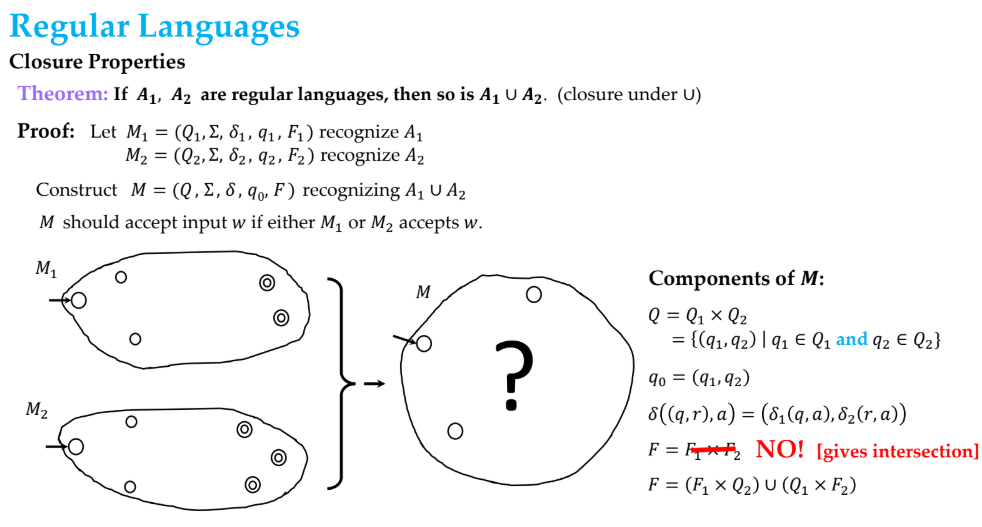

## Theory of Computing

```text
Please practice from the book for this lecture.
Introduction to the Theory of Computation by Michael Sipser.
Introduction to Automata Theory, Languages, and Computation by Ullman and Hopcroft
```
<b>What theory of computing is about?</b>
It is the mathematical study of limits of computation.
It focuses on:

1. What can be computed (Computability Theory), aka can it be done? (like turing machines)
2. How efficiently it can be computed (Complexity Theory), aka how fast can it be done? (like P vs NP)
3. How computation can be modeled (Automata Theory), aka to find out whats the simplest machine we can use? <i>This is like studying the evolution of computing power, from a simple on/off switch to a full-blown modern computer.</i>

Toc is the mathematical foundation that explores the ultimate capabilities and limitations of computers themselves.

### Automata

- Automaton : A self operating machine that performs a predetermined sequence of actions. Plural is Automata.
Formally, Say that A is the language of M1 and that M1 recognizes A and that A = L(M1).
  
- Some terms:
  

---
### Regular Languages
Regular Languages are the class of languages that can be recognized by Finite Automata, in other words, a language is regular if a finite automaton accepts it.

- Closure Properties of Regular Languages:
  1. Union
  2. Concatenation
  3. Star (Kleene Star)
  4. Intersection
  5. Complementation
  6. Difference, etc

- Closure property basically means,  If you take all strings that two regular expressions match, and combine them (union), the result is still describable by a regular expression.

  Simple analogy:
  Regular languages are like Lego sets that always produce more Lego sets when you combine them – never suddenly turn into a Meccano set.




---

- Pumping Lemma for Regular Languages:
  If A is a regular language, then there exists a pumping length p such that any string s in A with length at least p can be divided into three parts, s = xyz, satisfying the following conditions:
  1. For each i ≥ 0, the string xy^i z is in A.
  2. |y| > 0 (y is not empty)
  3. |xy| ≤ p