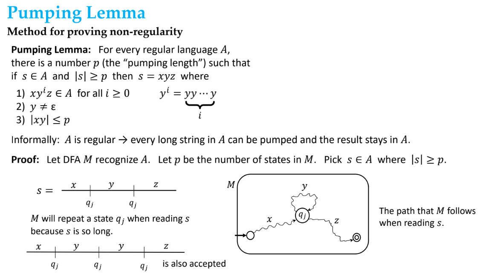
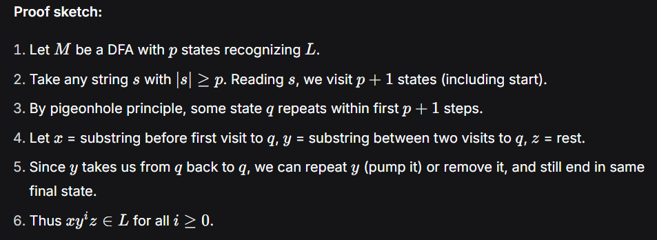

# Non-Regular Languages and Pumping Lemma

## Non-Regular Languages
Non-Regular Languages are formal languages that cannot be described by regular expressions
or recognized by a finite automaton. (maybe because they require infinite memory to count or match patterns)
To prove that a language is non-regular, the pumping lemma is used.

## Pumping Lemma

#### Good to Practice for exam
1. Problems that use contradiction to prove non-regularity.
2. Problems that combine closure properties with pumping lemma.
